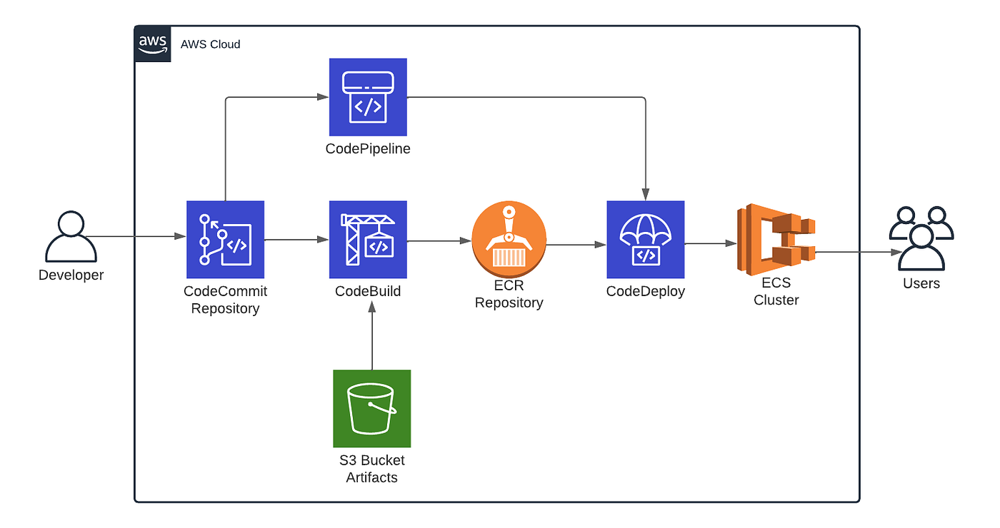

# Nextwork Web Project

  
  

---

## 📌 Project Overview

This project demonstrates a **full CI/CD pipeline on AWS** for deploying a Java web application.  
The application is packaged as a **WAR** using **Maven** and deployed to **Apache Tomcat** running on an **AWS EC2 instance (Amazon Linux with Corretto 8)**.  

The repo is designed as a **DevOps portfolio project** to showcase:  

- Automated build & deployment with **AWS CodeBuild** and **AWS CodeDeploy**  
- Secure IAM roles & policies for pipeline components  
- Artifact storage and distribution with **Amazon S3**  
- End-to-end workflow from code commit → running web app on EC2  

---

## ✨ Features

- Java WAR application packaged with Maven  
- CI/CD automation with AWS buildspec & appspec files  
- Deployment lifecycle hooks (stop server, copy WAR, start server)  
- Role-based access control with AWS IAM  
- Runs on Tomcat inside Amazon Linux EC2  
- Open-source, portfolio-ready reference project  

---

## 🏗️ Architecture

This project follows a standard AWS DevOps pipeline:  

> ℹ️ Two versions of the architecture diagram will be provided (simple schematic + AWS-branded).  

  

---

## 🛠️ Tech Stack

- **Language**: Java 8 (Corretto)  
- **Build Tool**: Maven  
- **Application Server**: Apache Tomcat  
- **Cloud Provider**: AWS  
  - EC2 (compute)  
  - S3 (artifact storage)  
  - CodeBuild (build automation)  
  - CodeDeploy (deployment automation)  
  - IAM (roles & policies for secure access)  

---

## 📂 Repository Structure

.
├── appspec.yml # Deployment specification for CodeDeploy
├── buildspec.yml # Build instructions for CodeBuild
├── pom.xml # Maven project configuration
├── settings.xml # Optional Maven settings (e.g. CodeArtifact auth)
├── scripts/ # Deployment lifecycle scripts (start, stop, copy)
├── src/ # Java source + web application resources
│ └── main/
│ └── webapp/
└── target/ # Build output (WAR and compiled classes)

---

## 🚀 CI/CD Pipeline

**Commit → Build → Store → Deploy → Run**

1. **GitHub**: Code changes are pushed to the repository.  
2. **CodeBuild**: Builds the WAR via Maven (`buildspec.yml`).  
3. **S3**: Stores build artifacts for distribution.  
4. **CodeDeploy**: Deploys the WAR to EC2 using lifecycle hooks from `appspec.yml` and `scripts/`.  
5. **EC2 (Tomcat)**: Hosts and runs the web application.  
6. **IAM**: Provides secure permissions across all services.  

---

## ⚙️ Deployment Workflow

1. Push code changes to GitHub.  
2. AWS CodeBuild compiles and packages the WAR.  
3. Artifact is uploaded to Amazon S3.  
4. AWS CodeDeploy fetches the artifact and runs deployment hooks:  
   - Stop Tomcat  
   - Copy WAR into `webapps/` directory  
   - Restart Tomcat  
5. Application is live on EC2 and accessible via public endpoint.  

---

## 📚 What I Learned

This project gave me hands-on experience with **end-to-end DevOps pipelines** and AWS cloud services. Key skills gained:

- **CI/CD pipelines**: Automating build, test, artifact storage, and deployment workflows  
- **AWS CodeBuild & CodeDeploy**: Implementing cloud-native build/deployment automation  
- **AWS IAM**: Creating and applying secure roles and policies using the principle of least privilege  
- **Amazon S3**: Managing artifacts as part of a deployment pipeline  
- **Linux server administration**: Configuring and managing **Amazon Linux** instances  
- **Apache Tomcat**: Deploying and running Java WAR applications in production-like environments  
- **Shell scripting**: Writing lifecycle hooks to stop/start services and manage deployments  
- **Cloud DevOps workflow**: Connecting **GitHub source control** to live AWS infrastructure  

This project represents my **first DevOps pipeline**, building foundational skills in **cloud automation, CI/CD, and modern infrastructure management**.  

---

## 📈 Roadmap

Planned improvements for expanding the DevOps pipeline:

- [ ] Containerization with **Docker** and orchestration on **ECS/EKS**  
- [ ] Infrastructure as Code with **Terraform** or **CloudFormation**  
- [ ] Automated testing & quality gates in CodeBuild  
- [ ] Monitoring & logging with **CloudWatch** + **ELK stack**  
- [ ] Blue/Green or Canary deployments with CodeDeploy  

---

## 📜 License

This project is licensed under the **MIT License** — free to use, modify, and share.  

---

## 🙌 Acknowledgements

- AWS DevOps learning resources and documentation  
- Maven + Tomcat community for Java web deployments  
- Nextwork learning challenges for providing project inspiration
